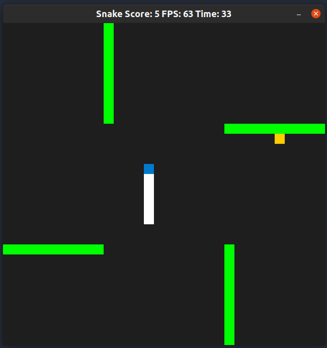
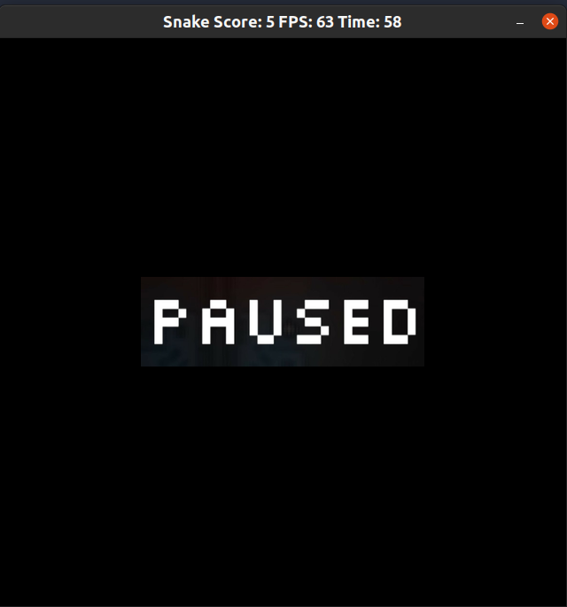
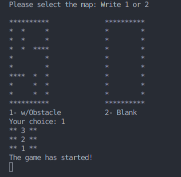
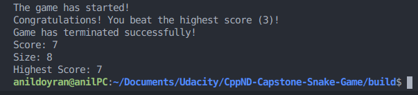

# CPPND: Capstone Snake Game

The Capstone Project gives you a chance to integrate what you've learned throughout this program. This project will become an important part of your portfolio to share with current and future colleagues and employers.

In this project, you can build your own C++ application or extend this Snake game, following the principles you have learned throughout this Nanodegree Program. This project will demonstrate that you can independently create applications using a wide range of C++ features.

## Dependencies for Running Locally
* cmake >= 3.7
  * All OSes: [click here for installation instructions](https://cmake.org/install/)
* make >= 4.1 (Linux, Mac), 3.81 (Windows)
  * Linux: make is installed by default on most Linux distros
  * Mac: [install Xcode command line tools to get make](https://developer.apple.com/xcode/features/)
  * Windows: [Click here for installation instructions](http://gnuwin32.sourceforge.net/packages/make.htm)
* SDL2 >= 2.0
  * All installation instructions can be found [here](https://wiki.libsdl.org/Installation)
  * Note that for Linux, an `apt` or `apt-get` installation is preferred to building from source.
* gcc/g++ >= 5.4
  * Linux: gcc / g++ is installed by default on most Linux distros
  * Mac: same deal as make - [install Xcode command line tools](https://developer.apple.com/xcode/features/)
  * Windows: recommend using [MinGW](http://www.mingw.org/)

## Basic Build Instructions

1. Clone this repo.
2. Make a build directory in the top level directory: `mkdir build && cd build`
3. Compile: `cmake .. && make`
4. Run it: `./SnakeGame`.

## The Changes that I Made in the Project

1. The time passed added to window title.
2. If the snake is not alive, window title does not refresh anymore.

3. When you press "p" button on the keyboard, the game pauses and a pause screen is shown.

4. User selects the map from the terminal at start, either with obstacles or blank.

5. Obstacle class added.
6. Placing the food controls the occupation of the obstacles and snake dies when it hits the obstacle.
7. Highest score property is added. Highest score is saved to an external file and loaded at start-up.

## Additional Project Rubrics Completed

### Loops, Functions, I/O

1. The project demonstrates an understanding of C++ functions and control structures.
  - Check obstacle.cpp: Getter functions, obstacle cell check function
  - Check game.cpp: saveHighestScore(), loadHighestScore() functions vs.
  - Check main.cpp: static getUserInput function

2. The project reads data from a file and process the data, or the program writes data to a file.
  - Highest score implementation uses reading from a file and writing to a file.
  - In the project workspace, ./save/highestScore.txt is used for this purpose.

3. The project accepts user input and processes the input.
  - Check main.cpp: static getUserInput function
  - User selects the map from the terminal.

### Object Oriented Programming

1. The project uses Object Oriented Programming techniques.
  - Check obstacle.cpp and obstacle.h
2. Classes use appropriate access specifiers for class members.
  - Check obstacle.cpp and obstacle.h
3. Class constructors utilize member initialization lists.
  - Check obstacle.cpp: Obstacle::Obstacle constructor uses member initialization list

### Memory Management

1. The project makes use of references in function declarations.
  - Check game.cpp: Game object constructor gets the selected map with pass by reference method
  - Check renderer.cpp: Render function gets the pause state with pass by reference method
2. The project uses destructors appropriately.
  - Check game.cpp: Game object destructor function frees the heap memory when the game is over if the map with obstacles is selected.
  